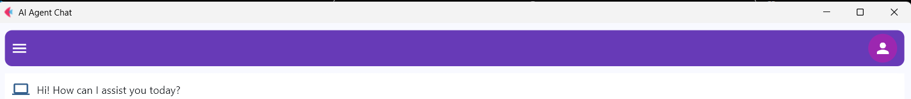

# 🤖 AI Agent Chat — Powered by Ollama, LangChain with Flet UI (Python)

A modern AI-powered chat interface built with [Flet UI](https://flet.dev/), integrated with [Ollama](https://ollama.ai/) LLMs and enhanced by [LangChain](https://www.langchain.com/). This project demonstrates a complete conversational AI agent with interactive animations, context-aware prompting, and real-time user interaction — all running locally.

<p align="center">
  
</p>
---

## 🗂️ Table of Contents

- [✨ Features](#-features)
- [🗂️ Project Structure](#️-project-structure)
- [⚙️ Installation](#️-installation)
- [🎯 Usage Guide](#-usage-guide)
- [🧰 Built With](#-built-with)
- [📄 License](#-license)
- [🤝 Contributing](#-contributing)
- [🧠 Acknowledgements](#-acknowledgements)
- [⭐ Future Enhancements](#-future-enhancements)
- [📬 Contact](#-contact)

---
## ✨ Features

### 🧑‍💻 User Interface
- Responsive and modern UI built with **Flet**
- Smooth animations (fade, slide, scale)
- Collapsible side navigation with toggle
- Chat interface using bubble-style messages
- User and AI avatars for a clean experience

### 🤖 AI Integration
- Built-in **Ollama LLM** (`qwen2.5-coder:1.5b`)
- Intelligent prompt formatting using **LangChain**
- In-memory caching for improved response time
- Response formatting criteria:
  - Accurate and complete information
  - Context-aware and easy to understand
  - Grammatically correct and natural phrasing

### 💬 Chat Functionality
- Real-time message updates and streaming
- Typing/loading animation for AI responses
- Send message via Enter key or Send button
- Input box with emoji icon and placeholder
- Auto-scroll to latest message on update

### 🧱 Code Structure
- Modular, component-based project structure
- Clear separation of UI, AI logic, and state management
- Uses modern design patterns
- Fully commented and formatted codebase

---

## 🗂️ Project Structure
```
├── core/
│ ├── animations/ # Animation helpers                           
│ ├── widegets/ # Reusable UI elements                            
│ ├── model_llm/ # LLM integration and prompt templates                      
│ ├── providers/ # State and screen management                     
│ └── interface/ # Main screens and layout views                               
└── LICENSE
└── README.md                 # Project documentation file.
└── demo.png
└── requirements-chatbot # Python dependences
└── main_app.py
└── struc.txt


```
---

## ⚙️ Installation

1. **Prerequisites:**
- Python 3.8+


2. **Clone the repository:**

  ```bash
  git clone https://github.com/8syncdev/ai-agent-chat.git
  cd ai-agent-chat
  ```
3. **Create and activate a virtual environment:**
  ```bash
  python -m venv venv
  source venv/bin/activate  # Windows: venv\Scripts\activate
  ```

4. **Install required packages:**
  ```bash
   pip install -r requirements-chatbot.txt
   ```
5. **Run the app:**
   ```bash
   python main_app.py # or python3 main_app.py
   ```
---
## 🎯 Usage Guide
- Type your question in the text box at the bottom of the screen.
- Press Enter or click the Send button.
- Wait for a response (AI typing animation shown).
- Use the side menu to toggle navigation panel.

---
## 🧰 Built With
- **Flet** – Python UI framework based on Flutter
- **LangChain** – Prompt engineering and LLM orchestration
- **Ollama** – Lightweight, local LLM deployment

---
## 📄 License
This project is licensed under the MIT License. See the [LICENSE](./LICENSE) file for details.

---
## 🤝 Contributing
I welcome contributions to improve this project!
Feel free to:
- Submit pull requests
- Report bugs
- Suggest new features

---
## ⭐ Future Enhancements
- Support for switching between multiple LLMs (e.g., Mistral, LLaMA)
- Add memory and context window for longer conversations
- Export chat history as PDF or Markdown
- Add user authentication for personalized AI agents
- Light/Dark theme toggle

--- 
## 📬 Contact
Contact for work: **Nguyễn Công Phát** – congphatnguyen.work@gmail.com

